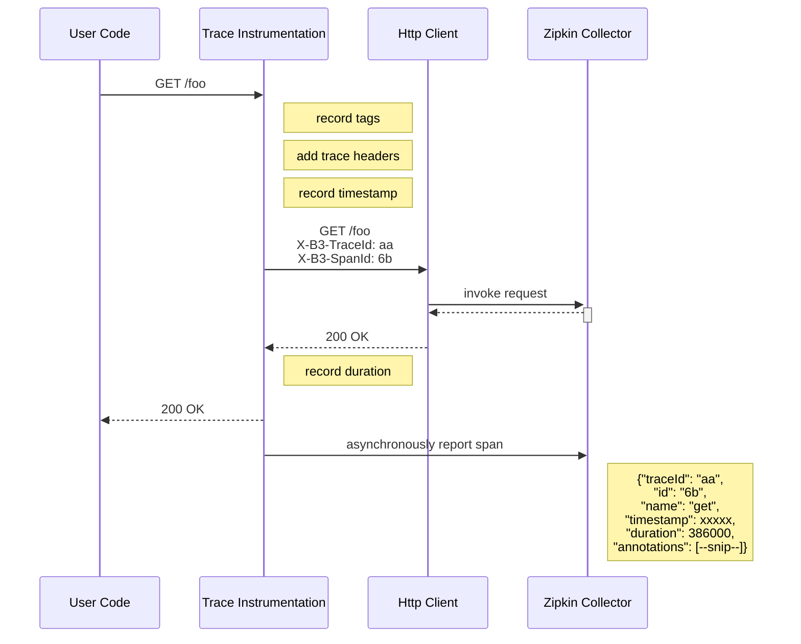
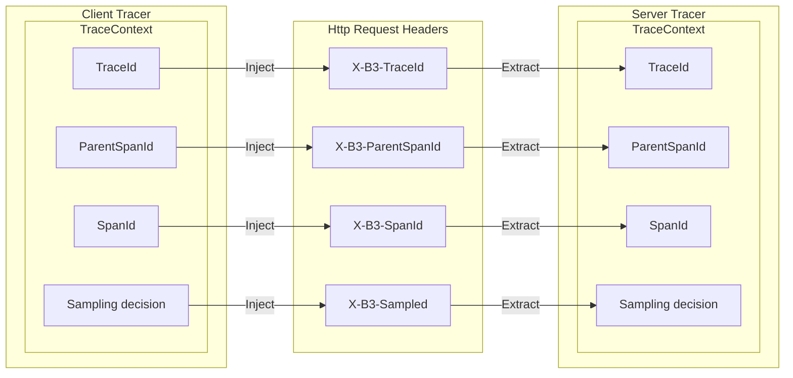

# Home

Zipkin 是一个分布式追踪系统，它有助于收集排查服务架构中延迟问题所需的计时数据。其功能包括数据的收集和查找。

如果日志文件中包含 `trace` ID，你可以直接跳转到该跟踪记录。否则，你可以根据服务、操作名称、标签和持续时间等属性进行查询。系统会为你汇总一些有用的数据，例如服务执行时间的百分比以及操作是否失败。

Zipkin UI 还会显示依赖关系图，展示有多少跟踪请求经过了每个应用程序。这有助于识别总体行为，包括错误路径或对已弃用服务的调用。

应用程序需要被 `instrumented` 才能向 Zipkin 报告跟踪数据。这通常意味着配置跟踪器或插桩库。向 Zipkin 报告数据最常用的方式是通过 HTTP 或 Kafka。当前还有许多其他选项，例如 Apache ActiveMQ、gRPC 和 RabbitMQ。提供给 UI 的数据存储在内存中，或者持久存储在受支持的后端（例如 Apache Cassandra 或 Elasticasearch）中。


# 快速开始

本节将介绍如何构建并启动 Zipkin 实例。

如果你熟悉 Docker，这是首选的启动方式。如果你不熟悉 Docker，请尝试通过 Java 或从源代码运行。

> 无论你如何启动 Zipkin，请浏览 `http://your_host:9411` 以查找痕迹。


## Docker

Docker Zipkin 项目能够构建 Docker 镜像，并提供脚本和 `docker-compose.yml` 文件用于启动预构建镜像。最快的入门方法是直接运行最新镜像：
```
docker run -d -p 9411:9411 openzipkin/zipkin
```

## Java

如果你已安装 Java 17 或更高版本，最快的入门方法是获取最新版本的独立可执行 jar 文件：
```
curl -sSL https://zipkin.io/quickstart.sh | bash -s
java -jar zipkin.jar
```

## Homebrew

如果你已经安装了 Homebrew，那么最快的入门方法是按照 Zipkin 程序。
```
brew install zipkin
# 运行在前台
zipkin
# 运行在后台
brew services start zipkin
```

## 从源代码运行

如果你正在开发新功能，Zipkin 可以从源代码运行。为此，你需要获取 Zipkin 的源代码并进行构建。
```
# 获取最新的源代码
get clone https://github.com/openzipkin/zipkin
cd zipkin
# 构建服务器并创建其依赖项
./mvnw -T1C -q --batch-mode -DskipTests --also-make -pl zipkin-server clean package
# 运行服务器
java -jar ./zipkin-server/target/zipkin-server-*exec.jar
# 或运行精简服务器
java -jar ./zipkin-server/target/zipkin-server-*slim.jar
```

如果你创作出了什么有趣的产品，欢迎来我们的 Gitter 聊天室和我们交流！


# 架构

## 架构概述

`Tracer` 存在于你的应用程序中，用于记录已发生操作的时间和源数据。它们通常会对库进行插桩，从而使用户对其使用透明。例如，经过插桩的 Web 服务器或记录何时收到请求以及何时发送响应。收集到的追踪数据称为 Span。

插桩机制的设计目标是在生产环境中安全运行并尽可能减少系统开销。因此，它仅通过内部的传播 ID，以告知接收方正在进行跟踪。已完成的跨度会在外部的报告给 Zipkin，类似于应用程序异步报告指标的方式。

例如，当追踪某个操作并且需要发出  HTTP 请求时，会添加一些标头来传递 ID。标头不用于发送操作名称等详细信息。

在已配置插桩的应用程序中，负责向 Zipkin 发送数据的组件被称为报告器（`Reporter`）。报告器通过多种传输方式之一将跟踪数据发送到 Zipkin 收集器（`Collector`），收集器会将跟踪数据持久化到存储中。之后，API 会查询存储中的数据，并将其提供给 UI。

下图描述了这一流程：
```
插桩客户端（Reporter）
↓							↓
未插桩服务器	 已插桩的服务器（Reporter）
							↓Transport
							Collector			
							↓
							Storeage -> API -> UI
							
							Database	
							
```

要查看你的平台是否已有追踪器或检测库，请参阅我们的列表。

## 示例流程

如概述中所述，标识符通过内部传输，详细信息则通过外部传输发送到 Zipkin。在这两种情况下，跟踪工具都负责创建有效的跟踪并正确 渲染它们。例如，跟踪器会确保其通过内部（下同）和外部（异步发送到 Zipkin）发送的数据保持一致。

以下是一个 HTTP 跟踪器示例序列，其中用户代码调用了资源 /foo，这会产生一个 span，在用户代码接收到 HTTP 响应后，该 span 会异步发送到 Zipkin。


跟踪插桩报告异步执行，以防止与跟踪系统相关的延迟或故障导致用户代码延迟或中断。

## 传输

由插桩库发送的 Span 必须从被追踪的服务传输到 Zipkin 收集器。主要有三种传输方式：HTTP、Kafka 和 Scribe。

## 组件

Zipkin 由4个组件构成：
- collector
- storage
- search
- web UI

### Zipkin 收集器

一旦跟踪数据到达 zipkin 收集器守护程序，它就会被验证、存储并建立索引，以便 Zipkin 收集器进行查找。

### 存储

Zipkin 最初设计用于将数据存储在 Cassandra 上，因为 Cassandra 具有可扩展性、灵活的模式。并且在 Twitter 中被广泛使用。但是，我们使该组件可插拔。除了 Cassandra 之外，我们还原生支持 Elasticsearch 和 MySQL。其他后端可能会以第三方扩展的形式提供。

### Zipkin 查询服务

数据存储并建立索引后，我们需要一种方法来提取它。查询守护进程提供了一个简单的 JSON API，用于查找和检索跟踪信息。此 API 的主要使用者是 Web UI。

### Web UI

我们创建了一个图形用户界面。它提供了一个友好的界面来查看跟踪信息。该 Web UI 提供了一种基于服务、时间和注释查看跟踪信息的方法。请注意：该 UI 没有内置身份验证功能。


# 跟踪器和插桩

我们使用已配置的库在每个主机上收集跟踪信息，并将其发送到 Zipkin。当主机向另一个应用程序发出请求时，它会将一些跟踪标识符随请求一起发送给 Zipkin，以便我们稍后将这些数据关联起来，形成 span。

## 支持

Zipkin 团队支持一下库。你可以通过 Gitter 聊天联系该团队。

| 语言 | 库 | 框架 | 传播支持 | 传输支持 | 是否支持采样 | 其他说明 |
| --- | --- | --- | --- | --- | --- | --- | --- |
| C# | Ziplin4net | Asp.net core, Owin | Http(B3) | 任意 | Yes | |
| Go | zipkin-go | 标准 Go 中间件 | Http(B3)、gRPC(B3) | Http(v2)、Kafka(v2)、Log | Yes | 使用 Zipkin v2 API |
| Java | brave | Jersey、gRPC、JAXRS2、Apache HttpClient、Kafka、JMS、MySQL 等更多| Http(B3)、RPC(B3)、Messaging(B3) | 与 zipkin-reporter-brave 相同 | Yes | Java 6 或更高 |
| JavaScript | zipkin-js | cujoJS、express、restify | Http(B3) | Http、Kafka、Scribe | Yes | 底层使用 continuation-local-storage，因此无需显式传递上下文 |
| Ruby | zipkin-ruby | Rack | Http(B3) | Http、Kafka、Scribe | Yes | 支持 lc。Ruby 2.0 或更高 |
| Scala | zipkin-finagle | Finagle | Http(B3)、Thrift | Http、Kafka、Scribe | Yes | 该库是用 Java 编写的。传播机制在 Finagle 中定义 |
| PHP | zipkin-php | Any | B3 | http、log、file | Yes | V2 原生基于 Brave 的模型，兼容 PHP 5.6 和 PHP 7.x。点击查卡示例 |
| Java | brave-cassandra | Apache Cassandra | CQL(B3) | 与 zipin-reporter-brave 相同 | Yes | Java 8+ |

## 社区支持

| 语言 | 库 | 框架 | 传播支持 | 传输支持 | 是否支持采样 | 其他说明 |
| --- | --- | --- | --- | --- | --- | --- | --- |
| Go | zipkin-go-opentracing | Go kit，或使用 OpenTracing 自行开发 | Http(B3)、gRPC(B3) | Http、Kafka、Scribe | Yes |  |
| Go | zipkintracing | Echo | Http(B3)，容易添加其他 | Http | Yes |  |
| Java | cassandra-zipkin-tracing | Apache Cassanadra | CQL(B3) | Http、Kafka、Scribe | Yes | Java 8+ |
| Java | Spring Cloud Sleuth | Spring、Spring  Cloud(例如 Steam，Netflix) | Http(B3)、Messaging(B3) | Http、兼容 Spring Cloud Stream（例如 RabbitMQ、Kafka、Redis 后任何自定义绑定器） | Yes | Java 7+ |
| Java | Micrometer Tracing | Spring Boot 3+ | B3、W3C | Http | Yes | Java 8+ |
| Java | Wingtips | 任何 Servlet API 框架，自定义框架、异步框架均受支持 | Http(B3) | Http | Yes | Java 7+，SLF4J MDC 支持自动为所有日志消息添加跟踪信息标签 |
| Lua | Apache APISIX-plugin-zipkin | Apache APISIX | Http(B3) | Http | Yes | 一个用于启用对 Zipkin 服务器跟踪的 Apache APISIX 插件 |
| Python | py_zipkin | 任意 | Http(B3) | 可插拔 | Yes | 通用 Python 追踪器，用于 pyramid-zipkin；支持 py2 和 py3 |
| Python | pyramid_zipkin | Pyramid | Http(B3) | Kafka、Scribe | Yes | 支持 py2 和 py3 |
| Python | swagger_zipkin | Swagger（Bravado），需与 py_zipkin 一起使用 | Http(B3) | Kafka、Scribe | Yes | 使用 py-zipkin；支持 py2 和 py3 |
| Python | aiozipkin | asyncio | Http(B3) | Http | Yes | Python 3.5+ 和原生协程 |
| Scala | kamon-zipkin | akka、akka-http | Http(B3) | Http | Yes | 用于跟踪和监控基于 JVM 的应用程序的工具包 |
| Scala | sttp | akka-http、async-http-client | Http(B3) | Http | Yes | 基于 Brave 封装，适用于任何使用 sttp 接口实现的 HTTP 后端 |
| PHP | zipkin-php-tracing | 任意 | B3 | Http、log、file | Yes | Zipkin v2 客户端，支持 OpenTracing API |
| Java | kafka-interceptor-zipkin | Apache Kafka | B3 | Http、Kafka | Yes | Java 8+，旨在用于 Kafka 连接器、KSQL和 Kafka REST 代理等现成组件。Kafka 客户端和 Kafka Streams 的检测功能中 |
| Go | zipkin-go-sql | 任意 |  |  |  | Go database/sql 的 SQL 插桩 |
| PHP | zipkin-instrumentation-symfony | Symfony | B3 | Http、log、file | Yes | 为 Symfony 应用程序集成 Zipkin |
| Serveral | opentelemetry | 任意 | B3、W3C | Http | Yes | 用于可观测性的工具包，预置了多种语言中许多库的插桩功能 |

我们是否遗漏了某个库？请向 openzipkin.github.io 提交 pull-request。

想为其他框架或平台创建插桩功能？我们有关于如何为库创建插桩功能的文档。


# 服务器扩展和选项

## 服务器扩展

Zipkin 服务器捆绑了用于 span 收集和存储的扩展。默认情况下，span 可以通过 HTTP、Kafka 或 RabbitMQ 传输进行收集，并存储在内存或 MySQL、Cassandra 或 Elasticsearch 中。

以下模块为默认服务器版本添加了存储或传输扩展功能。请参阅各模块的文档以获取设置和配置指南。

### OpenZipkin  支持

以下扩展程序由 OpenZipkin 团队支持，并托管在 OpenZipkin Github 群组中。你可以通过 Zipkin Gitter 聊天室联系该团队。

| 类型 | 模块 | 相关产品 | 其他说明 |
| --- | --- | --- | --- |
| Collector | zipkin-aws collector-sqs | AWS SQS | |
| Collector | zipkin-aws collector-kinesis | AWS Kinesis | |
| Storage | zipkin-aws storage-elasticsearch-aws | AWS Elasticsearch Service | |
| Storage | zipkin-aws storage-xray | AWS X-Ray | 仅支持向 XRay UDP 守护进程发送数据 |
| Storage | zipkin-gcp storage-stackdriver | GCP Stackdriver | 仅支持向 Stackdriver 发送数据 |

### 社区 支持

| 类型 | 模块 | 相关产品 | 其他说明 |
| --- | --- | --- | --- |
| Storage | zipkin-storage-forwarder | Apache Kafka（可选） | 转发到另一个 HTTP 或 Kafka 收集器 |
| Storage | zipkin-storage-kafka | Apache Kafka | 支持通过 Kafka Streams 状态存储对跟踪数据进行聚合和索引 |
| Reporter | spring-cloud-sleuth-haystack-reporter | Haystack | 支持向 Haystack 发送数据，Haystack 是一个具有弹性、可扩展的追踪和分析系统。 |

## 备用服务器

OpenZipkin 团队发布了 API、数据格式和共享库，允许其他后端处理发送到默认 Zipkin 服务器的相同数据。

### 社区 支持

一下列出了支持 Zipkin 格式的备选后端。有些后端使用与 Zipkin 想爱你沟通的代码，运行在相同的端点上；而另一些后端则运行在不同的端点上，或仅部分支持某些功能。无论如何，列出这些后端的目的是为了让现有的 Zipkin 客户端能够使用 OpenZipkin 团队不支持的后端。因此，如有疑问，请直接联系相应的后端社区。
- Apache Skywalking
	- 启用 Zipkin 跟踪组件后，Skywalking 会公开与 Zipkin 相同的 HTTP POST 端点和 Kafka 主题
		- http 端口 9411 接受 `/api/v1/spans`（thrift、json）和 `/api/v2/spans`（json、proto）POST 请求
		- Kafka `zipkin` 主题和 `zipkin` 组ID接受以 thrift/json/proto 列表形式编码的 v2 span，每个消息一个
		- 此扩展程序使用与 Zipkin 相同的编码库和相同的端点
  - 自 9.4.0 版本起，Zipkin Lens UI 也已集成到 Skywalking boostrer UI 中。`/zipkin` 由 Skywalking webapp 公开。
- Jaeger
	- 当设置 `COLLECTOR_ZIPKIN_HTTP_PORT=9411` 时，Jaeger 会公开 Zipkin HTTP POST 端点
		- http 端口 9411 接受 `/api/v1/spans`（thrift、json）和 `/api/v2/spans`（json、proto）POST 请求
  - 当 `SPAN_STORAGE_TYPE=kafka` 且 `zipkin-thrift` 时，Jaeger 会从Kafka主题读取Zipkinn v1 thrift 编码的 span 消息
  	- 注意：以上做法在 Zipkin 中已启用。大多数检测工具将 v2 格式的多个 span 打包到每条消息中。
- Pitchfork
		- Pitchfork 暴露了与 Zipkin 相同的 HTTP POST 端点。
			- http 端口 9411 接受 `/api/v1/spans`（thrift、json）和 `/api/v2/spans`（json、proto）POST 请求

我们是否遗漏了某个服务器扩展或替代方案？请向 openzipkin.github.io 提交 pull-request。


# Zipkin 社区

Zipkin 是一个追踪系统，最初由 Twitter 创建，目前由 OpenZipkin 志愿者组织运营。

## 什么是 Zipkin？

OpenZipkin 是一个开源软件组织，负责维护 Zipkin 代码、文档、规范和提供支持。它包括 Github 项目、本网站、Google 群组邮件列表、Twitter 和 Gitter。

## 保持最新状态

关注 `@zipkinproject` 的 Twitter 账户，获取包括版本发布公告和社区活动在内的最新资讯。你也可以在 Gitter 上提问。如果你正在编写代码，还可以关注你使用的服务器或插桩工具等项目。

## 积极参与社区活动

OpenZipkin 主要由志愿者组成，有很多方式可以提供帮助。加入 Gitter 后，你可能会发现其他人也在问 你以前问过的问题。回馈社区的一个好方法是帮助那些刚入门的人。我们会参加很多活动，这些活动是结识其他合作者的绝佳机会。你也可以像我们东京用户组那样，组织自己的 Zipkin 聚会。如果你在 Twitter 上看到什么有趣的内容，记得加上 #zipkin 标签，这样其他人也能看到。最后，你还可以参与代码编写、文档编写和项目维护。

## Zipkin 中的更改是如何运作的

大多数 OpenZipkin 项目最初都是局部实验，然后逐步积累用户，最终发展成为一项功能。在着手进行大规模项目中之前，无论是文档、测试框架还是新功能，都请先咨询上述渠道之一。可能有人过去已经做过类似的事情，并愿意加入你的项目。有时，某些功能可能会被故意忽略，通常会在 issue 中记录原因。无论如何，最好的建议是在提出更改之前加入社区，并阅读我们的 HACKING 文件之一，其中解释了变革文化的重要方面。

## OpenZipkin 品牌资源

### OpenZipkin 品牌指南

本指南将帮助你使用 Zipkin 的品牌颜色和符号来设计徽标。你可以通过以下链接获取原始图像文档（.svg、.png）。

# 数据模型

> 请注意，此页面内容已经过时。在页面更新之前，请查看 Zipkin API 文档，其中详细说明了模型中的各个字段。

为了更好地说明 Zipkin 显示的追踪数据，我们将其与 Zipkin 数据模型中的相应信息联系起来，通过比较，我们可以看到：
- 入站请求和出站请求处于不同的时间跨度
- 包含 `cs` 的 span 可以记录一个 `sa` 注解，指示它们要去向
	- 当目标协议（例如 MySQL）未进行 Zipkin 检测时，这会有所帮助
	

首先，我们在 Zipkin 轨迹查看器中看到一条轨迹。

Zipkin 数据模型中也存在同样的痕迹：
```
  [
    {
      "traceId": "5982fe77008310cc80f1da5e10147517",
      "name": "get",
      "id": "bd7a977555f6b982",
      "timestamp": 1458702548467000,
      "duration": 386000,
      "localEndpoint": {
        "serviceName": "zipkin-query",
        "ipv4": "192.168.1.2",
        "port": 9411
      },
      "annotations": [
        {
          "timestamp": 1458702548467000,
          "value": "sr"
        },
        {
          "timestamp": 1458702548853000,
          "value": "ss"
        }
      ]
    },
    {
      "traceId": "5982fe77008310cc80f1da5e10147517",
      "name": "get-traces",
      "id": "ebf33e1a81dc6f71",
      "parentId": "bd7a977555f6b982",
      "timestamp": 1458702548478000,
      "duration": 354374,
      "localEndpoint": {
        "serviceName": "zipkin-query",
        "ipv4": "192.168.1.2",
        "port": 9411
      },
      "tags": {
        "lc": "JDBCSpanStore",
        "request": "QueryRequest{serviceName=zipkin-query, spanName=null, annotations=[], binaryAnnotations={}, minDuration=null, maxDuration=null, endTs=1458702548478, lookback=86400000, limit=1}"
      }
    },
    {
      "traceId": "5982fe77008310cc80f1da5e10147517",
      "name": "query",
      "id": "be2d01e33cc78d97",
      "parentId": "ebf33e1a81dc6f71",
      "timestamp": 1458702548786000,
      "duration": 13000,
      "localEndpoint": {
        "serviceName": "zipkin-query",
        "ipv4": "192.168.1.2",
        "port": 9411
      },
      "remoteEndpoint": {
        "serviceName": "spanstore-jdbc",
        "ipv4": "127.0.0.1",
        "port": 3306
      },
      "annotations": [
        {
          "timestamp": 1458702548786000,
          "value": "cs"
        },
        {
          "timestamp": 1458702548799000,
          "value": "cr"
        }
      ],
      "tags": {
        "jdbc.query": "select distinct `zipkin_spans`.`trace_id` from `zipkin_spans` join `zipkin_annotations` on (`zipkin_spans`.`trace_id` = `zipkin_annotations`.`trace_id` and `zipkin_spans`.`id` = `zipkin_annotations`.`span_id`) where (`zipkin_annotations`.`endpoint_service_name` = ? and `zipkin_spans`.`start_ts` between ? and ?) order by `zipkin_spans`.`start_ts` desc limit ?",
        "sa": "true"
      }
    },
    {
      "traceId": "5982fe77008310cc80f1da5e10147517",
      "name": "query",
      "id": "13038c5fee5a2f2e",
      "parentId": "ebf33e1a81dc6f71",
      "timestamp": 1458702548817000,
      "duration": 1000,
      "localEndpoint": {
        "serviceName": "zipkin-query",
        "ipv4": "192.168.1.2",
        "port": 9411
      },
      "remoteEndpoint": {
        "serviceName": "spanstore-jdbc",
        "ipv4": "127.0.0.1",
        "port": 3306
      },
      "annotations": [
        {
          "timestamp": 1458702548817000,
          "value": "cs"
        },
        {
          "timestamp": 1458702548818000,
          "value": "cr"
        }
      ],
      "tags": {
        "jdbc.query": "select `zipkin_spans`.`trace_id`, `zipkin_spans`.`id`, `zipkin_spans`.`name`, `zipkin_spans`.`parent_id`, `zipkin_spans`.`debug`, `zipkin_spans`.`start_ts`, `zipkin_spans`.`duration` from `zipkin_spans` where `zipkin_spans`.`trace_id` in (?)",
        "sa": "true"
      }
    },
    {
      "traceId": "5982fe77008310cc80f1da5e10147517",
      "name": "query",
      "id": "37ee55f3d3a94336",
      "parentId": "ebf33e1a81dc6f71",
      "timestamp": 1458702548827000,
      "duration": 2000,
      "localEndpoint": {
        "serviceName": "zipkin-query",
        "ipv4": "192.168.1.2",
        "port": 9411
      },
      "remoteEndpoint": {
        "serviceName": "spanstore-jdbc",
        "ipv4": "127.0.0.1",
        "port": 3306
      },
      "annotations": [
        {
          "timestamp": 1458702548827000,
          "value": "cs"
        },
        {
          "timestamp": 1458702548829000,
          "value": "cr"
        }
      ],
      "tags": {
        "jdbc.query": "select `zipkin_annotations`.`trace_id`, `zipkin_annotations`.`span_id`, `zipkin_annotations`.`a_key`, `zipkin_annotations`.`a_value`, `zipkin_annotations`.`a_type`, `zipkin_annotations`.`a_timestamp`, `zipkin_annotations`.`endpoint_ipv4`, `zipkin_annotations`.`endpoint_port`, `zipkin_annotations`.`endpoint_service_name` from `zipkin_annotations` where `zipkin_annotations`.`trace_id` in (?) order by `zipkin_annotations`.`a_timestamp` asc, `zipkin_annotations`.`a_key` asc",
        "sa": "true"
      }
    }
  ]
```

# 对库进行插桩

> 这是一个进阶话题。在阅读之前，你可能需要确认你的平台是否已有现成的插桩库。如果没有，并且你想要创建一个检测库，那么首先，请加入 Zipkin Gitter 联调频道并告诉我们。我们非常乐意为你提供帮助。

## 概览

要对库进行插桩，你需要了解并创建以下元素：
- 核心数据结构 - 收集并发送到 Zipkin 的信息
- 追踪标识符 - 需要哪些标签才能让 Zipkin 按逻辑顺序重新组装信息？
	- 生成标识符 - 如何生成这些ID 以及哪些 ID 应该被继承
	- 传递追踪信息 - 与追踪信息及其 ID 一起发送给 Zipkin 的附加信息
- 时间戳和持续时间 - 如何记录有关操作的时间信息

### 核心数据结构

`Thrift` 的核心数据结构在注释中有详细说明。以下是一个简要概述，帮助你快速入门：

#### 注解

注解用于记录时间上的事件。有一组核心注解用于定义 RPC 请求的开始和结束。
- `cs` - 客户端发送（Client Send）。客户端已发出请求，这将设置 Span 的起始位置。
- `sr` - 服务端接收（Server Receive）。服务器已收到请求，并将开始处理。此状态与 `cs` 的区别在于网络延迟和时钟抖动。
- `ss` - 服务端发送（Server Send）。服务器已经处理并将请求值发送会客户端。此值与 `sr` 值之间的差值是服务器处理请求所花费的时间。
- `cr` - 客户端接收（Client Receive）。客户端已收到服务器的响应，这会结束一个 span。记录此注解后，RPC 请求被视为已完成。

当使用消息代理而不是 RPC 时，以下注解有助于明确信息流的方向：
- `ms` - 消息发送（Message Send）。生产者向代理发送消息。
- `mr` - 消息接收（Message Receive）。消费者收到来自代理的消息。

与 RPC 不同，消息传递 span 之间永远不会共享 span ID。例如，消息的每个消费者都是同一消息传递 span 的不同子 span。

在请求的生命周期内，还可以记录其他注解，以提供更深入的分析。例如，在服务器开始和结束一项耗时计算时添加注解，可以帮助我们了解请求的预处理和后处理分别花费了多少时间，以及运行计算本身花费了多少时间。

#### 二进制注解

二进制注解不包含时间信息。它们旨在提供有关 RPC 的额外信息。例如，在调用 HTTP  服务时，提供调用 URI 有助于后续分析进入该服务的请求。二进制注解还可以用于 Zipkin API 或 UI 中的精确匹配搜索。

`Endpoint` 注解和二进制注解都关联着一个端点。除两种例外情况外，该端点都与被跟踪的进程相关联。例如，Zipkin UI 中的服务名称下拉列表对应于 `Annotation.endpoint.serviceName` 或 `BinaryAnnotation.endpoint.servicceName`。为了提高可用性，`Endpoint.serviceName` 的基数应该受到限制。例如，它不应该包含变量或随机数。

#### Span

一组与特定 RPC 对应的注解和二进制注解。Span 包含标识信息，例如 traceId、spanId、parentId 和 RPC 名称。

span 通常很小。例如，序列化后的数据通常以 KB 或更小的单位衡量。当 span 增长到 KB 级别以上时，就会出现其他问题，例如达到 Kafka 消息大小限制（1MB）。即使可以提高消息大小限制，过大的 span 也会增加成本并降低追踪系统的可用性。因此，务必注意存储有助于解释系统行为的数据，而不要存储无益的数据。

#### Trace

一组共享一个根 span 的 span。Trace 是通过收集所有共享 traceId 的 span 来构建的。然后，这些 span 根据 spanId 和 parentId 排列成树状结构，从而提供请求在系统中所经过路径的概览。

### 跟踪标识符

要将一组 span 重新组装成完整的 trace，需要三个信息。trace 标识符可以是 128 位，但 trace 内的 span 标识符始终为 64 位。

#### Trace Id

trace 记录的64位或128位总ID。trace 记录中的每个 span 都共享此 ID。

#### Span Id

特定 span 的ID。这可能与 trace ID相同，也可能不同。

#### Parent Id

这是一个可选地 ID，仅存在于子 span 元素中。也就是说，没有父元素 ID 的 span 元素将被视为 trace 的跟元素。

### 生成标识符

让我们一起来看看如何识别 span。

当传入的请求没有附带任何跟踪信息时，我们会生成一个随机的 trace ID 和 span ID。span ID 可以与 trace ID 的低64位重复使用，但也可以完全不同。

如果请求已经附加了跟踪信息，则服务应该使用该信息，因为服务器接收和服务器发送事件与客户端发送和客户端接收事件属于同一 span。

如果服务调用下游服务，则会创建一个新的 span 作为原 span 的子 span。它使用相同的 trace ID 和一个新的 span ID 进行标识，Parent ID 设置为原 span 的 span ID，新的 span ID 应为64位随机数。

> 请注意：如果服务发出了多个下游调用，则必须重复此过程。也就是说，每个后续 span 都将具有相同的 trace ID 和 Parent ID，但 span ID 是新的且不同的。

### 传递跟踪信息

为了重建完整的跟踪信息，需要在上游和下游服务之间传递跟踪信息。需要五项信息：
- Trace Id
- Span Id
- Parent Id
- Sampled（已采样） - 告知下游服务是否应记录请求的跟踪信息
- Flags（标志位）- 提供创建和传递功能标志的功能。这样我们就可以告诉下游服务这是一个"debug"请求

Finagle 提供了通过 HTTP 和 Thrift 请求传递此信息的机制。其他协议也需要添加此信息才能有效进行跟踪。

#### 仪器采样决策是在系统边缘做出的

下游服务必须遵循上游系统的采样决策。如果传入的请求中没有 "已采样" 信息，库应决定是否对该请求进行采样，并将该决定包含在后续的下游请求中。这简化了对采样内容的计算，便于理解哪些内容被采样，哪些内容未被采样。此外，它还确保请求要么被完全追踪，要么完全不被追踪，从而使采样策略更易于理解和配置。

请注意，无论任何采样规则如何，调试标志都会强制对跟踪进行采样。调试标志也适用于存储层采样，该采样在 Zipkin 服务器端配置。

#### HTTP 跟踪

HTTP 标头被用于传递跟踪信息。

标题的 B3 部分之所以这样命名，是因为 Zipkin 的原名是：BigBrotherBird。

ID 以十六进制字符串编码：
- X-B3-TraceId: 128位或64位低十六进制编码（必需），对应为16位或8位字符串
- X-B3-SpanId: 64位低十六进制编码（必需），对应为8位字符串
- X-B3-ParentSpanId: 64位低十六进制编码（根 span 上不存在）
- X-B3-Sampled: 布尔值（`1` 或 `0`，可以为空）
- X-B3-Flags: `1` 意味着调试（可以为空）

有关 B3 的更多信息，请参阅规则说明。

#### Thrift 跟踪

Finagle 客户端和服务端在建立连接时会协商是否可以处理 Thrift 消息头部中的额外信息。协商完成后，跟踪数据会被打包到每个 Thrfit 消息的开头。


### 时间戳和持续时间

span 记录是指将时间信息或元数据结构化并报告给 Zipkin。此过程中最重要的部分之一是正确记录时间戳和持续时间。

#### 时间单位为微秒

所有 Zipkin 时间戳均以 Unix 纪元微妙为单位（而非毫秒）。此值应使用可用的最精确测量值。例如，可以使用 `clock_gettime` 函数，或者直接将 Unix 纪元微秒乘以 1000。时间戳字段以 64 位有符合整数形式存储，即负数无效。

微秒级精度主要用于支持 "local span"，即进程内操作。例如，更高的精度可以帮助您分辨出某个事件发生之前发生的细微差别。

所有时间戳都存在误差，包括主机间的时钟偏差以及时间服务将时钟重置回原位的可能性。因此，span 应尽可能记录其持续时间。

#### span 持续时间也为微秒

虽然可以获取纳秒级精度的计时信息，但 Zipkin 使用的是微秒级精度。原因如下：

首先，使用与时间戳相同的单位可以简化计算。例如，如果你正在排查某个时间跨度的问题，使用单位相同的术语会更容易识别。

其次，记录某一 span 的开销通常可变的，可能是微秒级或更长：建议比开销更高的分辨率可能会分散注意力。

Zipkin 的未来版本可能会重新探讨这个话题，但就目前而言，一切都以微秒为单位。

#### 何时设置 span 的时间戳和持续时间

span 的时间戳和持续时间只能由启动 span 的主机配置。

最简单的逻辑通常是这样的：
```
unless (logging "sr" in an existing span) {
	set Span.timestamp and duration
}
```

Zipkin 会将具有相同跟踪 ID 和 span ID 的 span 合并在一起。最常见的情况是合并客户端（cs、cr）和服务器（sr、ss）都报告的 span。例如，客户端启动一个 span，记录 "cs" 并通过 B3 标头传播，服务器则通过记录 "sr" 来继续该 span。

在这种情况下，客户端启动了 span，因此它应该记录 span 的时间戳和持续时间，并且这些值应该与 cs 和 cr 之间的差值相匹配。服务器没有启动此 span，因此它不应该设置 span 的时间戳和持续时间。

另一种常见情况是，当服务器从未插桩的客户端（例如 Web 浏览器）启动根 span 时。它知道应该启动跟踪，因为 B3 标头或其他类似文件中没有跟踪信息。既然已经启动了跟踪，它就应该记录根 span 的时间戳和持续时间。

请注意：当一个 span 不完整时，您可以设置时间戳，但不能设置持续时间，因为没有足够的信息来准确地设置它。

#### 如果未设置 span 的时间戳和持续时间会发生什么情况？

span 的时间戳和持续时间是 Zipkin 在 2015 年（即 Zipkin 启动三年后）添加的字段。并非所有库都会记录这些字段。如果这些字段未设置，Zipkin 会在查询时（而非数据收集时）添加它们；这并非理想做法。

持续时间查询将无法进行，因为没有数据可供查询。此外，本地（进程内）span 不需要注释。因此除非设置了时间戳，否则无法对其进行查询。

当持续时间未通过插桩机制设置时，Zipkin 会尝试在查询时推导持续时间，但这需要使用存在问题的时间戳计算方法。例如，如果在 span 内发生了 NTP 更新，Zipkin 计算出的持续时间就会出错。

最后，许多用户希望迁移到单主机 span。实现这一目标的迁移路径是将双主机 RPC span 拆分为两个。当检测日志仅记录其拥有的 span 的时间戳时，拆分后的收集器可以使用启发式方法来区分服务器发起的根 span 和客户端发起的双主机 span。

总之，选择不记录 span 的时间戳和持续时间会导致数据准确性降低，功能也会受到影响。由于在生成报告之前很容易权威地记录这些信息，因此所有 Zipkin 工具都应该这样做，获取请其他人协助完成。


### Message 追踪

Message 追踪与 RPC 追踪不同，因为生产者和消费者不共享 span ID。

在常规的 RPC 追踪中，客户端和服务端注解位于同一个 span 上。但这不适用于 Message，因为一条消息可能有多个消费者。传递给消费者的跟踪上下文是其父上下文。

Message 追踪没有响应路径，它只使用两个注解：`ms` 和 `mr`。与 RPC 追踪类似，可以设置 span 的时间戳和持续时间，因为生产者使用单独的 span，而每个消费者也使用单独的 span。

因此，生产者将 `ms` 添加到 span 元素中，并将其报告给 Zipkin。然后，每个消费者创建一个子 span 元素，并将 `mr` 添加到其中。

以下是 Message 追踪示意图：
```
   Producer Tracer                                    Consumer Tracer
+------------------+                               +------------------+
| +--------------+ |     +-----------------+       | +--------------+ |
| | TraceContext |======>| Message Headers |========>| TraceContext | |
| +--------------+ |     +-----------------+       | +--------------+ |
+--------||--------+                               +--------||--------+
   start ||                                                 ||
         \/                                          finish ||
span(context).annotate("ms")                                \/
             .address("ma", broker)          span(context).annotate("mr")
                                                          .address("ma", broker)
```

以下是使用 `Brave Tracer` 实现此过程的示例：

Producer 侧：
```
// 向出站 span 添加跟踪标识符
tracing.propagation().injector(Message::addHeader)
	.inject(span.context(), message);
	
producer.send(message);

// 开始和结束生产者侧
span.kind(Span.Kind.PRODUCER)
	.remoteEndpoint(broker.endpoint())
	.start().finish();
	
// 上述操作将向 Zipkin 报告跟踪标识符、`ms` 注解（指向生产者端点）和 `ma`（消息地址，指向代理端点）
```

Consumer 侧：
```
// 从消息头中解析 span
TraceContextOrSamlingFlags result = tracing.propagation().extractor(Message::addHeader).extract(message);

// 通过加入上下文来重用相同的 span ID
span = tracer.newChild(result.context());

// 开始和结束消费者端，指示消息已到达
span.kind(Span.Kind.CONSUMER)
	.remoteEndpoint(broker.endpoint())
	.start().finish();
	
// 上述内容将向 Zipkin 报告跟踪标识符，`mr` 注解（消费者端点）和 `ma`（消息地址，代理端点）
```

许多消费者会批量操作，同时接收大量消息。将每个消费者 span 的跟踪上下文注入到其对应的消息头中可能很有帮助。这样，处理器稍后就能在跟踪树的正确位置创建子进程。

以下是使用 Kafka 的 poll API 实现此功能的示例：
```
public ConsumerRecords<K, V> poll(long timeout) {
	ConsumerRecords<K, V> records = delegate.poll(timeout);
	for (ConsumerRecord<K,V> record : records) {
		handleConsumed(record);
	}
	return records;
}

void handleConsumed(ConsumerRecord<K,V> record) {
	// 通知 Zipkin 记录已达到
	Span span = startAndFinishConsumerSpan(record);
	// 允许处理器查看父ID（消费者跟踪上下文）
	injector.inject(span.context(), record.headers());
}
```

# 测试和部署脚本

这是一个 Jekyll 项目，其中只包含 [test] 命令，因为文件将按原样通过 Github Pages 提供。

与基于代码的项目不同 ，我们测试的只是文档提交：这实际上就是一个网站！

## 构建概览

`build-bin` 包含 CI 中用于测试和部署项目的可移植脚本。

这里的脚本是可移植的，不包含任何特定于 CI 提供商的逻辑或环境变量。这使得 `.travis.yml` 和 `test.yml`（Github Actions）的内容几乎相同，即使某些 OpenZipkin 项目需要进行一些细微的调整。由于功能和配额限制，OpenZipkin 不得不多次更换 CI 提供商，因此可移植性至关重要。

这些脚本还有第二个用途，那就是方便手动发布，这种情况经常发生，通常是由于持续集成（CI）提供商的服务中断造成的。虽然使用 CI 提供商特定的工具很诱人，但这样做很容易造成依赖关系，导致没有人知道如何发布。不要使用提供商特定的机制来实现发布流程。相反，应该在此处自动触发脚本。

每个项目唯一需要修改的脚本位于根目录下。子目录（例如 [docker]）中的脚本，除非版本漂移，否则不应项目而异。对子目录的任何有意更改都必须是相关的，并且需要在多个项目中进行测试，以确保可以盲目复制粘贴。

相反，根目录中的文件是项目特定的测试和部署操作入口点，完全可以根据项目而有所不同。以下是概述：

## 测试

测试构建并运行项目的所有测，包括集成测试。持续集成（CI）提供商应配置为在拉取请求或推送至主分支时运行测试，尤其是在标签为空时。测试不应在仅包含文档的提交上运行。测试不得依赖于已认证的资源，因为运行测试可能会泄露凭据。Git 检出应包含完整的历史记录，以便进行许可证标头或其他 Git 分析。
-	[configure_test] - 设置测试的构建环境
-	[test] - 构建并运行此项目的测试

### Github Actions 示例

最简单的 Github Actions `test.yml` 文件会在配置完成后运行测试，但仅在相关事件发生时才运行。`test.yml` 文件名称和 `test` 作业名称便于引用状态徽章，并确保其使用的脚本一致。

`on:` 部分可以避免为无关事件创建作业和占用资源。值得注意的是，Github Actions 允许跳过仅用于文档编写的作业。

将 [configure_test] 和 [test] 合并到同一 `run:` 中，当 `configure_test` 初始化系统缓存时。

以下是仅包含上述内容的 `test.yml` 部分示例：
```
on:
	push:
		tags: ''
		branches: master
		paths-ignore: '**/*.md'
	pull_request:
		branches: master
		paths_ignore； ‘**/*.md’

jobs:
	test:
		steps:
			- name: Checkout Repository
			  uses: actions/checkout@v2
				with:
					fetch-depth: 0 # full git repository
			- name: Test
				run: build-bin/configure_test && build-bin/test
```

### Travis 设置示例

`.travis.yml` 是一个整体式的配置文件，它被划分为多个阶段，默认阶段为 "test"。最简单的 Travis `test` 作业会在 `install` 过程中配置测试，并将其作为 `script` 运行，但仅在满足特定事件时才运行。

`if:` 部分可以避免为无关事件创建作业和占用资源。Travis 不支持文件条件。在 `before_install` 步骤中跳过仅用于文档的提交，通常会在一分钟内完成（消耗10积分）。

以下是仅包含上述内容的 `.travis.yml` 部分内容。
```yml
git:
	depth: false # 保留完整的 Git 历史记录以进行许可证检查，仅跳过文档
	
jobs:
	include:
		- stage: test
			if: branch = master AND tag IS blank AND type IN (push, pull_request)
			name: Run unit and integration tests
			before_install: |
				if [ -n "${TRAVIS_COMMIT_RANGE}" ] && ! git diff --name-only "${TRAVIS_COMMIT_RANGE}" -- | grep -qv '\.md$'; then
					echo "Stopping job as changes only affect documentation (ex. README.md)"
					travis_terminate 0
				fi
			install:	./build-bin/configure_test
			script: ./build-bin/test
```


## 部署

将构建版本部署到远程仓库，并将构建产物推送至主分支和发布分支。持续集成（CI）提供商会在主分支标签为空时部署推送，但不会部署仅包含文档的提交。发布版本应根据版本标签（例如 ·/^[0-9]+\.[0-9]+\.[0-9]+/·）进行部署，而无需考虑提交是否仅包含文档。
- [configure_deploy] - 设置环境并登录 ，假设没有调用 [configure_test]
- [deploy] - 部署项目，arg0 可以是 `master` 会类似 `1.2.3` 的发布提交

### Github Actions 设置示例

最简单的 Github Actions `deploy.yml` 文件会在登录后部署，但仅在满足特定事件条件时才会部署。`deploy.yml` 文件名称和 `deploy` 作业名称便于引用状态徽章，并确保其引用的脚本一致。

`on:` 部分避免了为无关事件创建作业和占用资源。Github Actions 无法在同一文件中实现 `master，但仅提交文档` 的策略。因此，即使 README 文件发生更改，也会部署 master 分支。

将[configure_deploy] 和 [deploy] 合并到同一 `run:` 中：当 `configure_deploy` 初始化文件系统缓存时。

以下是一个仅包含上述内容的 `deploy.yml` 文件片段。请注意，环境变量已明确定义，并且 `on.tags` 是一个 glob 模式。
```
on:
	push:
		tags: '[0-9]+.[0-9]+.[0-9]+**' # 例如 8.272.10 或 15.0.1_p9
		branches: master

jobs:
	deploy:
		steps:
			- name: Checkout Repository
				uses: actions/checkout@v2
				with:
					fetch_depth: 1 # 只要获取 sha 标签
			- name: Deploy
				env:
					GH_USER: $
					GH_TOKEN: $
				run: | # GITHUB_REF 将是 refs/heads/master 或 refs/tags/N.M.L
					build_bin/configure_deploy &&
					build_bin/deploy $(echo ${GITHUB_REF} | cut -d/ -f 3)
				
```

### Travis 设置示例

`.travis.yml` 是一个整体式的配置文件，它被划分为多个阶段，这意味着 `test` 和 `deploy` 都在一个文件中。最简单的 Travis `deploy` 部署阶段包含两个任务：一个用于主分支推送，另一个用于版本标签。这些任务由事件条件控制。

`if:` 部分可以避免为无关事件创建作业和占用资源。Travis 不支持文件条件。在 `before_install` 步骤中跳过仅用于文档的提交，通常会在一分钟内完成（消耗10积分）。

由于计费是按分钟计算的，因此将测试和部署合并到主分支推送中最具成本效益。

以下是仅包含上述内容的 `.travis.yml` 部分内容。请注意，YAML 描点在 Travis 中有效，并且 `=~` 条件是一个正则表达式。
```yml
git:
	depth: false # 保留完整的 Git 历史记录以进行许可证检查，仅跳过文档
	
_terminate_if_only_docs: &terminate_if_only_docs |
	if [ -n "${TRAVIS_COMMIT_RANGE}" ] && ! git diff --name-only "${TRAVIS_COMMIT_RANGE}" -- | grep -qv '\.md$'; then
  	echo "Stopping job as changes only affect documentation (ex. README.md)"
    travis_terminate 0
  fi
	
jobs:
	include:
		- stage: test
			if: branch = master AND tag IS blank AND type IN (push, pull_request)
			before_install: *terminate_if_only_docs
			install: |
				if [ "${TRAVIS_SECURE_ENV_VARS}" = "true" ] && [ "${TRAVIS_PULL_REQUEST}" = "false" ]; then
					export SHOULD_DEPLOY=true
					./build-bin/configure_test
				else
					export SHOULD_DEPLOY=false
					./build-bin/configure_test
				fi
			script: 
				- ./build-bin/test || travis_terminate 1
				- if [ "${SHOULD_DEPLOY}" != "true" ]; then travis_terminate 0; fi
				- travis_wait ./build-bin/deploy master
		- stage: deploy
			if: tag =~ /^[0-9]+\.[0-9]+\.[0-9]+ AND type = push AND env(GH_TOKEN) IS present
			install: ./build-bin/configure_deploy
			script: ./build-bin/deploy ${TRAVIS_TAG}
			
```


# b3-propagation

B3 传播规范是针对标头 `b3` 以及以 `x-b3-` 开头的标头的规范。这些标头用于跨服务边界传播跟踪上下文。

> github.com/oppenzipkin/b3-propagation

## 概述

本规范详细阐述了用于在跟踪树中定位操作的标识符。这些属性在进程内传播，并最终向下游传播（通常通过 HTTP 标头），以确保所有源自同一根节点的活动都会被收集在一起。在跟踪的根节点会做出采样决策，该决策指示是否应收集跟踪详细信息并将其报告给跟踪系统（通常是 Zipkin）。


## 总体流程

最常见的传播用例是从发送 RPC 请求的客户端复制跟踪上下文到接收该请求的服务器。

在这种情况下，使用相同的 span ID，这意味着操作的客户端和服务端最终都会出现在跟踪树中的同一个节点中。

以下是一个使用多种标头编码的示例流程，假设 HTTP 请求携带传播的跟踪信息。


跟踪标识符通常与采样决策一起发送。然而，单独发送采样决策也是一种有效且常见的做法。以下是一个代理禁止跟踪 `/health` 端点的示例。图中显示接收方创建了一个 NoOp 跟踪上下文，以确保最小的开销。

```meramid
flowchart LR
	subgraph Request["Health Check Request"]
		direction TB
		R1["GET /health"]
		R2["X-B3-Sampled: 0"]
	end
	
	subgraph Server["Server Tracer"]
		subgraph ST["TraceContext"]
			N1["NoOp"]
		end
	end
	
	R2 -- Extract --> N1
```


## 标识符

跟踪标识符为64位或128位，但跟踪内的所有 span 标识符均为64位。所有标识符均不透明。

标识符几乎总是与采样状态一起发送，但也可以单独发送以实现下面描述的"延迟"决策。

### TraceId

TraceId 的长度为64为或128位，表示跟踪的整体ID。跟踪中的每个 span 都共享此 ID。

### SpanId

SpanId 的长度为64位，指示当前操作在跟踪树中的位置。该值不应被解释；它可能源自 TraceId 的值，也可能并非如此。

### ParentSpanId

ParentSpanId 的长度为64位，指示父操作在跟踪树中的位置。当 span 位于跟踪树的根节点时，则不存在 ParentSpanId。


## 采样状态

采样是一种减少最终进入追踪系统的数据量的机制。在 B3 中，采样是按追踪一致应用的：一旦做出采样决策，就应该始终向下游发送相同的值，这意味着这你会看到所有 span 要么共享同一个追踪 ID，要么都不共享追踪 ID。

以下是有效的采样状态。请注意，它们都适用于追踪ID，而不是 span ID：
- Defer：也就是我还不知道！
	- 当代理服务器设置了跟踪标识符，但该代理服务器不向 Zipkin 发送数据时，会使用 Defer。Defer 最常见的用例是预先配置跟踪标识符。
	- 在所有已知的编码中，Defer 表示没有采样状态。
- Deny: 即不采样或不记录
	- Deny 用于实现概率性拦截或阻止某些路径（例如健康检查）生成跟踪信息。在可能的情况下，插桩机制应优化 Deny 操作，以减少开销。
- Accept: 又称样本或记录
	- Accept 用于实现概率性跟踪率，或确保始终跟踪某些路径（例如低流量端点）。接受跟踪后，除过载情况外，应将 span 报告给 Zipkin。
- Debug: 又称强制跟踪
	- Debug 是 curl 或 Chrome 调试工具中使用的生成环境故障排除辅助工具。Debug 是一种强制的采样决策，它不仅标识接受，还会为跟踪中的每个 span 报告 `Span.debug=true`。

采样最常见的用途是概率性的：例如，接受 0.01% 的跟踪数据，拒绝其余数据。Debug 是最不常见的用途。

采样状态几乎总是与标识符一起发送，但也可以单独发送（预先设定的决定）。这用于以下几种用例：
- Deny: 使用固定条目作为拒绝决策比生成标识符更有效。但是，执行此操作的库无法进行外部ID关联，例如日志关联。
- Accept: 某些代理发送一个固定的条目来表示接受决定，因为他们希望追踪特定的路径，但又不想干扰ID的生成。
- Debug: 有些支持指南在发送调试信息时不包含ID，因为在 curl 中这样做更容易。


## 编码

以下是一些预定义的编码方式。最早的编码方式是多 HTTP 头部编码（2012年）。此后，又出现了一些应用说明，以及一种紧凑的单头部编码。此外，还可以定义二进制编码。

大多数用户无需了解此处列出的编码，因为它们已经内置于库、框架和代理中。虽然本规范力求完整，但无法详述所有用例和实践。如有任何疑问，请联系 Zipkin Gitter 社区。

### 自定义编码

我们建议复用现有编码而不是开发新的编码，因为即使是经验丰富的人也会尝尝忽略一些细微之处。例如，某个代理错误地使用连字符来代替缺失的 ParentSpanId。这会导致跟踪信息损坏，在某些极端情况下甚至会导致请求奔溃。某些类型的软件发布周期长达数月或更久，这增加了清理代码的难度，因为代码中可能存在大量冗余的信息。识别并解答此类问题会给其他支持人员增加不公平的负担，因为他们事先并未被咨询。即使排除格式不匹配的问题，对功能集的误解也可能导致日后高昂的维护成本。

避免代价高昂的错误的最佳方法是重用现有的编码。其次，在设计自定义编码时，务必完整阅读规范，并向规范作者寻求反馈。如果你正在设计新的编码，请联系 Zipkin 的 Gitter 社区，以便最大程序地避免重蹈覆辙。


## Http 编码

有两种编码的 B3：单标头和多标头。多标头编码在跟踪上下文中对每个元素使用 `X-B3-` 前缀头部。单标头则将上下文分隔成一个名为 `b3` 的单个条目。提取字段时，单标头编码优于多标头编码。

## 多标头编码

B3 属性通常以多个 HTTP 标头的形式传播。所有 B3 标头都遵循 `x-B3-${name}` 的格式，标志位有特殊大小写。提取状态标头时，第一个值优先。

请注意：HTTP 标头不区分大小写，但有时其他传输方式也会使用这种编码方式。在区分大小写的传输方式中，建议使用小写键或显式使用小写字母的单标头编码。

如前所述，标识符可以与采样状态一起发送，也可以不带采样状态发送，反之亦然。理解这些头部之间的关系至关重要。例如，`X-B3-TraceId` 和 `X-B3-SpanId` 可以单独发送，也可以与采样头部 `X-B3-Sampled` 一起发送。单独发送采样状态也是有效的，例如拒绝采样：`X-B3-Sampeld: 0`。

请注意：`X-B3-Sampled` 和 `X-B3-ParentSpanId` 这两个头部信息可以缺失。缺失表示该头部信息不存在。空头部信息（例如 `X-B3-Sampled:`）或任意无意义的值（例如 `X-B3-ParentSpanId: -`）均属于格式错误的数据。

### TraceId

`X-B3-TraceId` 头部编码为32位或16为低十六进制字符。例如，一个128为 TraceId 头部可能如下所示：`X-B3-TraceId: 463ac35c9f6413ad48485a3953bb6124`。除非仅传播采样状态，否则 `X-B3-TraceId` 头部是必需的。

### SpanId

`X-B3-SpanId` 头部采用16个小写十六进制字符编码。例如，一个 SpanId 头部可能如下所示：`X-B3-SpanId: a2fb4a1d1a96d312`。除非仅传播采样状态，否则 `X-B3-SpanId` 头部是必需的。

### ParentSpanId

`X-B3-ParentSpanId` 标头可以出现在子 span 中，但不能出现在根 span 中。它以16个小写十六进制字符编码。例如，ParentSpanId 标头可能如下所示：`X-B3-ParentSpanId:0020000000000001`。

### 采样状态

接受采样决策编码为 `X-B3-Sampled: 1`，拒绝采样决策编码为 `X-B3-Sampled: 0`。如果未编码 ，则表示将决策权交给该报头的接收方。例如，采样报头可能如下所示：`X-B3-Sampled: 1`。

请注意：在本规范编写之前，一些追踪器将 `X-B3-Sampled` 的值表示为 `true` 或 `false`，而不是 `1`或 `0`。虽然你不应该将 `X-B3-Sampled` 编码为真或假，但宽松的实现可能会接受它们。

#### Debug 标志 

调试信息编码为 `X-B3-Flags: 1`。缺失值或任何其他值均可忽略。调试信息表示接受请求，因此无需同时发送 `X-B3-Sampeld` 标头。


## 单标头编码

一个名为 `b3` 的单一头部从2018年底标准化，用于JMS 和 W3C `tracestate`。其设计和原理详见此处。请查看或更新我们的状态页面，了解其采用情况。

简单来说，`b3` 将传播字段映射到以连字符分割的字符串：`b3={TraceId}-{SpanId}-{SamplingState}-{ParentSpanId}`，其中最后两个字段是可选的。

例如，以下状态以多个标头的形式编码：
```
X-B3-TraceId: 80f198ee56343ba864fe8b2a57d3eff7
X-B3-ParentSpanId: 05e3ac9a4f6e3b90
X-B3-SpanId: e457b5a2e4d86bd1
X-B3-Sampled: 1
```

例如，合并成一个 `b3` 标头：
```
b3: 80f198ee56343ba864fe8b2a57d3eff7-e457b5a2e4d86bd1-1-05e3ac9a4f6e3b90
```

请注意：仅当传播采样决策时，标头仍命名为 `b3`，但仅包含采样决策。

拒绝采样的编码为：
```
b3: 0
```

### TraceId

`b3` 值的第一个位置是32位或16为低十六进制字符。除非仅传播采样状态，否则 `TraceId` 头部是必需的。

例如，TraceId 为 `80f198ee56343ba864fe8b2a57d3eff7` 的编码位于最左侧位置：
```
b3: 80f198ee56343ba864fe8b2a57d3eff7-e457b5a2e4d86bd1-1
```

### SpanId

`b3` 值的第二个位置是16位小写十六进制字符。除非仅传播采样状态，否则 `SpanId` 头部是必需的。

例如，SpanId 为 `e457b5a2e4d86bd1` 的内容编码在最左侧的连字符之后：
```
b3: 80f198ee56343ba864fe8b2a57d3eff7-e457b5a2e4d86bd1-1
```

### 采样状态

当采样状态不是延迟（Defer）时，它会被编码为 `b3` 值的第三位的一个十六进制字符。采样状态也可以单独发送（不带任何标识符）。

除延迟（Defer）状态外，所有状态的采样状态编码均为一个十六进制字符。延迟（Defer）状态表示采样字段缺失。
- Accept: `1`
- Deny: `0`
- Debug: `d`

例如，调试跟踪可能如下所示：
```
b3: 80f198ee56343ba864fe8b2a57d3eff7-e457b5a2e4d86bd1-d
```

拒绝采样可能会省略标识符，看起来就像这样:
```
b3: 0
```

### ParentSpanId

如果存在，ParentSpanId 是 `b3` 最后一个位置的16低十六进制字符。

例如，ParentSpanId 为 `05e3ac9a4f6e3b90` 的元素编码在最右侧的位置：
```
b3: 80f198ee56343ba864fe8b2a57d3eff7-e457b5a2e4d86bd1-1-05e3ac9a4f6e3b90
```


## gRPC 编码

B3 属性也可以作为 ASCII 标头传递到请求的自定义元数据中。其编码方式与 HTTP 标头完全相同，只是名称会显示或隐式地转换为小写。

例如，当使用多标头时，`X-B3-ParentSpanId：0020000000000001` 编码为具有相同值的 ASCII 标头 `x-b3-parentspanid`。


## JMS 编码

JMS(Java Message Service) 存在一些限制，不允许使用以 `X-B3-` 为前缀的头部。因此，JMS 只能使用单一的头部格式 `b3`。由于消息传递跨度之间不会共享 SpanId，因此建议在传播消息时省略 ParentSpanId 字段。

详细信息请参阅我们的设计文档。

## 常见问题解答

### 为什么 ParentSpanId 会被传播？

在 B3 版本中，跟踪上下文是从传入的请求头中提取的。操作的客户端和服务端的计时和元数据都记录在同一个上下文中。ParentSpanId 是引发当前 RPC 操作的 ID。例如，它可以是另一个服务端请求或计划任务的ID。ParentSpanId 会被传播，以便在将数据报告给 Zipkin 时，能够将其放置在跟踪树中正确的位置。

以下是一个 B3 库从传入的 HTTP 请求头中提取跟踪上下文的示例:
```

```

某些传播格式与 B3 类似，但不会传播名为 parent 的字段。相反，它们会传播一个名为 span ID 的字段，其作用与 ParentSpanId 相同。与 B3 不同的是，这些系统在 RPC 的客户端和服务端使用不同的 span ID。当服务器读取此类标头时，它需要为自己分配一个新的 span ID，并将提取的 span ID 用作其父级。

以下是一个替代库的示例，该库使用传入的 HTTP 请求标头和 ID 生成器来构建跟踪上下文：
```
```

在 B3 和上述示例中，传入的头部信息都包含父级 span 的ID，并且跟踪上下文中最终会包含三个ID（trace、parent 和 span）。区别在于，B3 在 RPC 的客户端和服务端使用相同的 span ID，而上述示例则不然。


### 为什么传播拒绝采样决定？

你可能不太清楚为什么要将拒绝采样决定发送到下一跳。想象一下，某个服务决定不跟踪某个操作，并发出两个出站调用，而这些调用又进一步分发出去。如果拒绝（不跟踪）指令没有传播出去，系统可能只会接收到部分操作信息，从而导致用户困惑。

拒绝采样的另一个原因是防止高吞吐量使收集器过载。如果拒绝采样的决定没有被传播，就无法告知出站调用的接受者不应向收集器发送 span 信息。

#### 为什么要在拒绝抽样决定的情况下发送跟踪ID？

虽然仅传播拒绝采样决定（`X-B3-Sampled: 0`）是有效的，但如果已建立跟踪标识符，则也应该传播这些标识符。跟踪系统通常并非跟踪标识符的唯一使用者。即使服务不向收集器发送 span 数据，它们可能仍然需要使用跟踪信息，例如，使用跟踪 ID 标记日志。


### 为什么要推迟采样决定？

推迟采样决定是一种特殊情况。目前已知的应用场景只有以下几种：
- 调试跟踪：调试跟踪隐式地被视为可接受的跟踪。
- 外部配置的 ID：当你希望控制 ID，但不希望控制采样策略时。

除非是调试跟踪，否则省略采样决策通常是由于 ID 关联造成的。例如，有人重用了来自其他系统的全局标识符，或者在日志中进行关联。在这些情况下，调用者知道他们想要的 ID，但允许下一跳决定是否对其进行跟踪。除非调用者传播了接受采样的决策，否则不应使用此 ID 向跟踪系统报告 span。


### 为什么 Debug 被编码为 X-B3-Flags: 1？

第一个时候 B3 的追踪器是 Finagle。在 Finagle 中，thrift-rpc 是主流协议，并且使用固定宽度的二进制编码来存储 S3 属性。这种二进制编码使用位域来编码采样决策和调试标志。

Http 编码选择使用单独的头部来处理采样决策，但保留了用于调试的标志字段。事后看来，使用单独的头部（例如 `X-B3-Debg: 1`）会更合理，因为没有添加其他标志，而且没有任何实现将 `X-B3-Flags` 视为位域。然后，重命名该字段弊大于利，因此最终保留了原样。


### B3 上下文和跟踪数据格式之间有什么关系？

当你看到任何类型的 B3 标头时，不能假定带外数据采用 Zipkin 格式，甚至不能假定这些数据已发送到跟踪系统。例如，有些系统会将跟踪数据嵌入到与标头中相同 ID 关联的日志行中。而另一些系统则使用 B3 标头来存储格式截然不同的跟踪数据。

也就是说，数据通常是通过带外传输的，并且传出的字段与数据中的某些字段匹配。例如，在 Zipkin 格式中，除了 Accept 和 Deny 标志之外的所有字段都会被报告。这是因为 Accept 标志是隐含的，而 Deny 标志不会导致数据被报告。

#### 向跟踪系统报告数据时处理 B3

代理服务器（例如 Envoy）可能会接收与应用程序发送的 B3 标头关联的跟踪数据。根据配置情况，该代理服务器可能会对发送跟踪数据的行为本身发起跟踪，从而增加发送到你的跟踪系统的流量，并可能包含低值或负值的跟踪数据。虽然大多数网站不会跟踪发送到跟踪系统的数据，但通常有两种方法可以解决这种代理设置问题：
- 配置代理，使其不跟踪你的跟踪报告端点（例如，在 Zipkin 中，`POST /api/v2/spans`）。
- 发送 `b3: 0` 标头（显示 Deny），以防止跟踪。

我们建议你的跟踪报告发送 `b3: 0`。这会增加所有人的成本，仅仅是为了帮助那些代理跟踪数据的用户。然而，在网格环境中，代理所有数据正在变得越来越普遍，而实际上，最终用户更改代理采样策略的能力非常有限。

请注意：我们不建议同时发送 `X-B3-Sampled: 0`，因为代理问题是最近才出现的，而且主要局限于 Envoy，而 Envoy 本身本身已经支持 B3 单标头格式。发送更大的第二个标头会给其他没有此问题的用户带来更多麻烦。换句话说，少数缺少 B3 单标头支持的代理应该更新，而不是因为缺少此功能而给更多用户造成负担。


